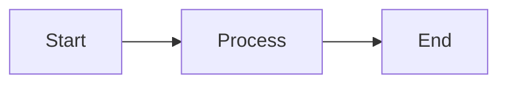

# Quick Start Guide - Better Markdown for SharePoint

Get the Better Markdown web part up and running in your SharePoint environment in under 15 minutes.

## 📋 Prerequisites

Before you begin, ensure you have:

- **Node.js** - Version 16.x or 18.x LTS ([Download](https://nodejs.org/))
- **SharePoint Online tenant** with admin access
- **Global or SharePoint Administrator** permissions
- **Modern browser** - Edge (Chromium), Chrome, Firefox, or Safari

### Verify Node.js Installation

```bash
node --version  # Should show v16.x or v18.x
npm --version   # Should show 8.x or higher
```

## 🚀 Installation

### Step 1: Download the Project

```bash
# If using git
git clone <repository-url>
cd better-markdown-webpart

# Or download and extract the ZIP file
cd path/to/better-markdown-webpart
```

### Step 2: Install Dependencies

```bash
# Install all required packages
npm install
```

This will install:
- SharePoint Framework tools
- markdown-it and plugins
- highlight.js, KaTeX
- All dev dependencies

**Note:** This may take 3-5 minutes depending on your internet connection.

### Step 3: Trust the Development Certificate

Required for local testing with HTTPS:

```bash
gulp trust-dev-cert
```

**Windows:** You may see a security prompt - click "Yes" to trust the certificate.
**macOS:** Enter your password when prompted.

## 🔨 Development & Testing

### Start Local Development Server

```bash
gulp serve
```

This will:
1. Build the project
2. Start the development server
3. Open your browser to the SharePoint Workbench

### Test in SharePoint Workbench

Two options for testing:

**Option 1: Local Workbench (Limited)**
```
https://localhost:4321/temp/workbench.html
```
- Good for UI testing
- Limited SharePoint context

**Option 2: Hosted Workbench (Recommended)**
```
https://yourtenant.sharepoint.com/_layouts/15/workbench.aspx
```
- Full SharePoint context
- Test in real environment
- Requires tenant access

### Add the Web Part

1. Click the **+** (Add) button in the workbench
2. Search for "Better Markdown"
3. Click to add it to the page
4. Edit properties to add your markdown content

### Hot Reload

The dev server supports hot reload - make changes to your code and see them instantly:

- Edit `.ts` files → Auto-recompile
- Edit `.scss` files → Auto-refresh styles
- Save changes → Browser refreshes automatically

## 📦 Building for Production

### Build the Package

```bash
# Run the production build
npm run package
```

This command runs:
1. `gulp clean` - Removes previous builds
2. `gulp bundle --ship` - Creates optimized bundle
3. `gulp package-solution --ship` - Generates .sppkg file

### Locate the Package

The generated package will be at:
```
sharepoint/solution/better-markdown-webpart.sppkg
```

**Important:** This file is what you'll upload to SharePoint.

### Package Contents

The .sppkg file contains:
- Compiled JavaScript bundles
- CSS stylesheets
- Web part manifest
- Localization resources
- CDN references (Mermaid)

## 🚢 Deployment to SharePoint

### Step 1: Access App Catalog

1. Go to SharePoint Admin Center
2. Navigate to **More features** → **Apps** → **Open**
3. Click **App Catalog**

If you don't have an App Catalog:
1. SharePoint Admin Center → **More features**
2. Under **Apps**, click **Open**
3. Click **Create a new app catalog site**
4. Follow the wizard

### Step 2: Upload the Package

1. In the App Catalog, click **Apps for SharePoint**
2. Click **Upload** or drag the .sppkg file
3. Check **Make this solution available to all sites in the organization**
4. Click **Deploy**

### Step 3: Add to a Site

**Method 1: From Site Contents**
1. Go to your SharePoint site
2. Click **Settings** (gear icon) → **Add an app**
3. Search for "Better Markdown"
4. Click **Add**

**Method 2: Direct to Page**
1. Edit a SharePoint page
2. Click **+** to add a web part
3. Search for "Better Markdown"
4. Add to page

### Step 4: Configure the Web Part

1. Click **Edit web part** (pencil icon)
2. In the property pane, configure:
   - Add your markdown content
   - Enable/disable features (Mermaid, Math, TOC, etc.)
   - Choose theme (light/dark)
3. Click **Publish** to save the page

## ✅ Testing Features

### Test Basic Markdown

Add this to the web part:

```markdown
# Test Header

This is **bold** and this is *italic*.

- List item 1
- List item 2

[Test Link](https://example.com)
```

### Test Mermaid Diagrams

````markdown

````

### Test Math

```markdown
Inline: $E = mc^2$

Block:
$$
\sum_{i=1}^{n} i = \frac{n(n+1)}{2}
$$
```

### Test Styled Blockquotes

```markdown
> Important information
{.is-info}

> Be careful!
{.is-warning}
```

### Test Syntax Highlighting

````markdown
```typescript
const greeting: string = "Hello, SharePoint!";
console.log(greeting);
```
````

## 🔧 Configuration Options

### Web Part Properties

| Property | Type | Default | Description |
|----------|------|---------|-------------|
| Markdown Content | Text | Sample | Your markdown text |
| Enable Mermaid | Boolean | true | Render diagrams |
| Enable Math | Boolean | true | Render equations |
| Enable TOC | Boolean | true | Generate table of contents |
| Enable Syntax Highlighting | Boolean | true | Highlight code blocks |
| Theme | Dropdown | light | Visual theme (light/dark) |

### Performance Tips

- **Disable unused features** - Turn off Mermaid/Math if not needed
- **Minimize TOC** - Only use on pages with multiple sections
- **Optimize images** - Use compressed images and CDN URLs
- **Cache content** - For large documents, consider caching strategies

## 🔄 Updating the Web Part

### Update Existing Deployment

1. Make your code changes
2. Update version numbers:
   ```json
   // package.json
   "version": "1.0.1"

   // config/package-solution.json
   "version": "1.0.1.0"
   ```
3. Build the package:
   ```bash
   npm run package
   ```
4. Upload to App Catalog (same location)
5. Click **Replace** when prompted
6. Existing instances will update automatically

### Force Update

If web parts don't update:
1. SharePoint Admin Center → App Catalog
2. Find the app → Click **Files** tab
3. Delete the old .sppkg
4. Upload the new .sppkg
5. Refresh pages using the web part

## 🐛 Troubleshooting

### Common Issues

#### "Cannot find module" errors during npm install
```bash
# Clear npm cache and reinstall
npm cache clean --force
rm -rf node_modules package-lock.json
npm install
```

#### Certificate trust issues (macOS)
```bash
# Manual certificate trust
sudo gulp trust-dev-cert
```

#### Web part not visible in toolbox
- Ensure app is deployed from App Catalog
- Check that "Make available to all sites" was selected
- Try adding from **Site Contents** → **Add an app**
- Clear browser cache and refresh

#### Mermaid diagrams not rendering
- Check browser console for errors
- Verify internet connectivity (CDN required)
- Try a simpler diagram to test
- Check CDN URL in `config/config.json`

#### Math equations showing as raw LaTeX
- Verify "Enable Math" is turned on in properties
- Check for syntax errors in LaTeX
- Ensure KaTeX CSS is loading (check Network tab)

#### Styles not applying
- Hard refresh the page (Ctrl+F5 / Cmd+Shift+R)
- Clear browser cache
- Check for CSS conflicts with other web parts
- Inspect element to verify classes are applied

#### Build fails
```bash
# Clean and rebuild
gulp clean
npm run build
```

#### "Node Sass could not find a binding" error
```bash
npm rebuild node-sass
```

### Debug Mode

Enable verbose logging:

```typescript
// Add to BetterMarkdownWebPart.ts onInit()
protected onInit(): Promise<void> {
  console.log('🚀 Initializing Better Markdown');
  console.log('Properties:', this.properties);
  console.log('Context:', this.context);

  return super.onInit().then(() => {
    console.log('✅ Initialization complete');
  });
}
```

### Check Package

Verify the package was built correctly:

```bash
# List contents of .sppkg (it's a ZIP file)
unzip -l sharepoint/solution/better-markdown-webpart.sppkg
```

## 📊 Version Management

### Semantic Versioning

Follow semantic versioning (MAJOR.MINOR.PATCH):

- **MAJOR** - Breaking changes (2.0.0)
- **MINOR** - New features, backward compatible (1.1.0)
- **PATCH** - Bug fixes (1.0.1)

### Update Both Files

Always update versions in:
1. `package.json` → `"version": "1.0.1"`
2. `config/package-solution.json` → `"version": "1.0.1.0"`

The last number in package-solution.json is the build number.

## 🔐 Security Notes

### Content Security

- HTML rendering is **disabled by default**
- All user input is escaped
- No inline scripts are executed
- Follows SPFx security sandbox

### CDN Dependencies

The web part loads Mermaid from CDN:
```
https://cdn.jsdelivr.net/npm/mermaid@11.12.0/dist/mermaid.min.js
```

For air-gapped environments, consider:
- Bundling Mermaid locally
- Hosting on internal CDN
- Using organization's approved CDN

## 📱 Mobile Testing

### Test on Mobile Devices

1. Deploy to SharePoint
2. Open SharePoint site on mobile browser
3. Navigate to page with web part
4. Test responsive behavior

### SharePoint Mobile App

The web part is compatible with:
- SharePoint Mobile App (iOS/Android)
- Mobile browsers (Safari, Chrome)
- Tablet devices

## 🚀 Next Steps

### Advanced Customization

1. **Modify Styles** - Edit `BetterMarkdownWebPart.module.scss`
2. **Add Plugins** - Extend markdown-it functionality
3. **Custom Themes** - Create your own color schemes
4. **External Storage** - Fetch markdown from SharePoint lists

### Integration Ideas

- **Document Libraries** - Render .md files from libraries
- **SharePoint Lists** - Store markdown in list columns
- **Search Integration** - Make markdown content searchable
- **Workflow Integration** - Trigger workflows from markdown changes

### Learn More

- Review the full **[README.md](./README.md)** for detailed documentation
- Explore markdown-it plugins at https://www.npmjs.com/search?q=markdown-it
- Check Mermaid diagram examples at https://mermaid.js.org/
- Learn KaTeX syntax at https://katex.org/docs/supported.html

## 💡 Tips for Success

1. **Start Simple** - Begin with basic markdown, add features gradually
2. **Test Incrementally** - Test each feature (Mermaid, Math, etc.) separately
3. **Use Templates** - Create markdown templates for common content types
4. **External Editors** - Use VS Code or Typora for complex content
5. **Version Control** - Keep your markdown content in source control
6. **Performance** - Disable unused features for better performance
7. **Documentation** - Document your markdown patterns for your team

## 🆘 Getting Help

### Resources

- **Issues** - Check existing issues first
- **Documentation** - Review README.md for detailed info
- **SharePoint Community** - Ask in SharePoint Tech Community
- **Stack Overflow** - Tag questions with `spfx` and `markdown`

### Useful Commands Reference

```bash
# Development
npm install              # Install dependencies
gulp serve              # Start dev server
gulp serve --nobrowser  # Start without browser

# Building
npm run build           # Build project
npm run package         # Build production package
gulp clean              # Clean build artifacts

# Certificate
gulp trust-dev-cert     # Trust dev certificate
gulp untrust-dev-cert   # Revoke certificate

# Debugging
gulp serve --verbose    # Verbose logging
```

---

**🎉 Congratulations!**

You now have Better Markdown running in your SharePoint environment. Start creating rich, beautiful content with advanced markdown features!

**Need help?** Review the comprehensive [README.md](./README.md) for examples and customization options.
