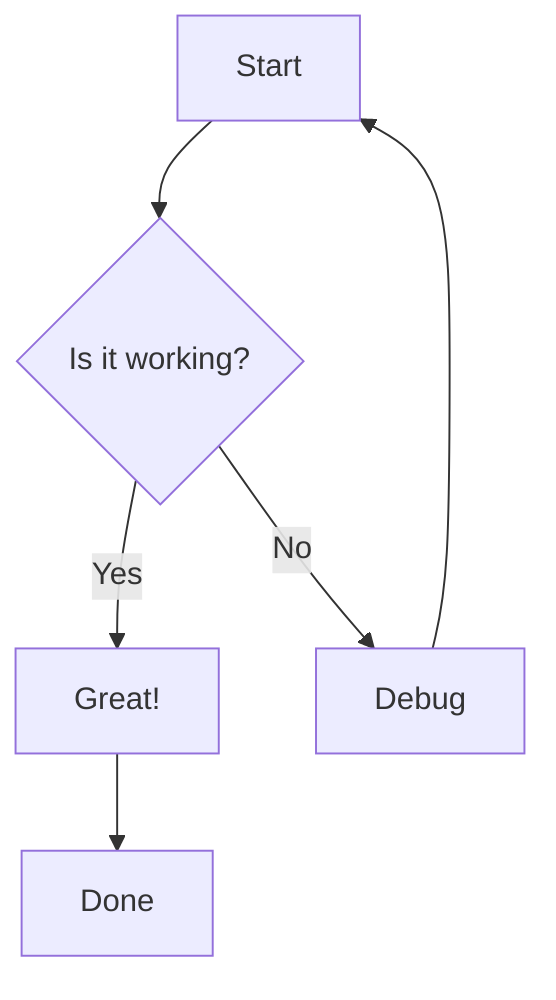
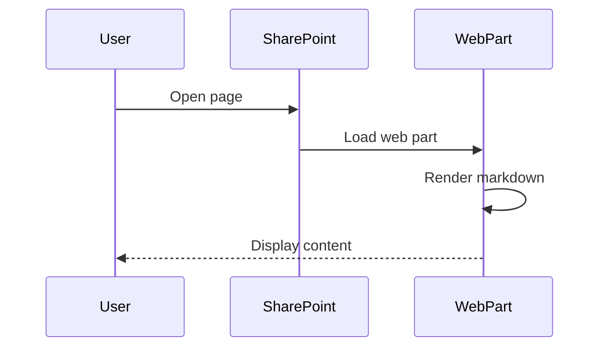
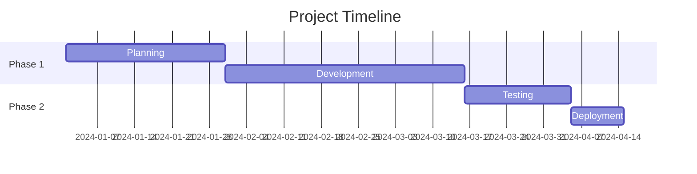

# Better Markdown for SharePoint

A comprehensive SharePoint Framework (SPFx) web part that brings advanced markdown rendering to SharePoint Online. Originally inspired by Wiki.js, this web part provides rich markdown support including Mermaid diagrams, mathematical expressions, syntax highlighting, table of contents generation, and advanced styling features.

## Releases
Available here: https://github.com/npapadacis/better-markdown-webpart/releases

## ✨ Features

### Core Markdown Support
- ✅ Full CommonMark specification compliance
- ✅ GitHub Flavored Markdown (GFM) extensions
- ✅ Tables with colspan and rowspan support
- ✅ Lists (ordered, unordered, nested)
- ✅ Links and images
- ✅ Nested blockquotes

### Content Sources
- ✅ **Manual Entry** - Edit markdown directly in property pane
- ✅ **SharePoint Library Browser** - Browse and select .md files from document libraries
- ✅ **Direct URL** - Load markdown from any accessible URL
- ✅ **Auto-refresh** - Automatically reload when files change in SharePoint
- ✅ **Version History** - View and restore previous versions of SharePoint files

### Advanced Styling Features
- ✅ **Styled Blockquotes** - Info, warning, danger, and success variants
- ✅ **Grid Lists** - Display lists in responsive grid layouts
- ✅ **Links Lists** - Enhanced link displays with descriptions
- ✅ **Custom CSS Classes** - Apply styling with `{.class-name}` syntax
- ✅ **Attribute Support** - Add IDs and classes to any markdown element

### Advanced Features
- ✅ **Mermaid Diagrams** - Flowcharts, sequence diagrams, Gantt charts, and more
- ✅ **Math Rendering** - LaTeX equations with KaTeX (inline and block)
- ✅ **Table of Contents** - Auto-generated TOC with `[[toc]]`
- ✅ **Syntax Highlighting** - 185+ programming languages via highlight.js
- ✅ **Footnotes** - Full footnote support
- ✅ **Emoji** - Emoji shortcodes and rendering
- ✅ **Smart Typography** - Automatic quote beautification

### Editing & Export
- ✅ **Monaco Editor** - Advanced code editor with syntax highlighting
- ✅ **Live Preview** - Real-time preview while editing
- ✅ **Split View** - Side-by-side editor and preview
- ✅ **Scroll Sync** - Synchronized scrolling between editor and preview
- ✅ **PDF Export** - Export rendered content to PDF

### User Experience
- ✅ Light and dark themes
- ✅ Fully responsive design
- ✅ Sticky table of contents sidebar
- ✅ Copy buttons on code blocks
- ✅ Property pane configuration
- ✅ Toggleable features for performance
- ✅ Unsaved changes protection

## 🚀 Quick Start

See **[QUICK_START.md](./QUICK_START.md)** for detailed installation and deployment instructions.

### Prerequisites
- Node.js v22.x (LTS) - [Download](https://nodejs.org/)
- SharePoint Online tenant
- SharePoint Administrator access

### Installation

```bash
# Clone or download the repository
cd better-markdown-webpart

# Install dependencies
npm install

# Trust development certificate (first time only)
gulp trust-dev-cert

# Start local development server
gulp serve
```

### Build and Deploy

```bash
# Build for production
npm run package

# The .sppkg file will be in sharepoint/solution/
# Upload to your SharePoint App Catalog
```

## 📚 Usage Examples

### Basic Markdown

```markdown
# Heading 1
## Heading 2
### Heading 3

**Bold text** and *italic text* and ~~strikethrough~~

- Bullet list item 1
- Bullet list item 2
  - Nested item

1. Numbered list
2. Another item

[Link text](https://example.com)

```

### Styled Blockquotes

Add visual emphasis to important information:

```markdown
> This is important information for users to know.
{.is-info}

> Warning: This action cannot be undone!
{.is-warning}

> Error: Something went wrong with your request.
{.is-danger}

> Success: Your changes have been saved.
{.is-success}
```

### Mermaid Diagrams

Create flowcharts, sequence diagrams, and more:

````markdown





````

### Math Equations

Render beautiful mathematical expressions:

```markdown
Inline math: The famous equation is $E = mc^2$

Block equation:
$$
\int_{-\infty}^{\infty} e^{-x^2} dx = \sqrt{\pi}
$$

Matrix notation:
$$
\begin{bmatrix}
a & b \\
c & d
\end{bmatrix}
$$

Fractions and symbols:
$$
\frac{-b \pm \sqrt{b^2 - 4ac}}{2a}
$$
```

### Table of Contents

Automatically generate a table of contents:

```markdown
[[toc]]

# Introduction
This is the introduction section...

## Background
Some background information...

## Methods
Description of methods...

### Data Collection
Details about data...

### Analysis
How we analyzed...

# Results
Our findings...

# Conclusion
Final thoughts...
```

### Syntax Highlighting

Beautiful code blocks with line numbers:

````markdown
```typescript
interface User {
  id: number;
  name: string;
  email: string;
  roles: string[];
}

class UserService {
  private users: User[] = [];

  addUser(user: User): void {
    this.users.push(user);
    console.log(`Added user: ${user.name}`);
  }

  getUser(id: number): User | undefined {
    return this.users.find(u => u.id === id);
  }
}
```

```python
def fibonacci(n):
    """Generate Fibonacci sequence up to n terms."""
    a, b = 0, 1
    for _ in range(n):
        yield a
        a, b = b, a + b

# Print first 10 Fibonacci numbers
for num in fibonacci(10):
    print(num)
```

```sql
SELECT
    u.name,
    COUNT(o.id) as order_count,
    SUM(o.total) as total_spent
FROM users u
LEFT JOIN orders o ON u.id = o.user_id
WHERE u.active = 1
GROUP BY u.id, u.name
HAVING COUNT(o.id) > 0
ORDER BY total_spent DESC;
```
````

### Advanced Tables

Tables with colspan, rowspan, and alignment:

```markdown
| Feature | Status | Notes |
|---------|:------:|-------|
| Markdown | ✅ | Full GFM support |
| Mermaid | ✅ | All diagram types |
| Math | ✅ | KaTeX rendering |
| TOC | ✅ | Auto-generated |

<!-- Colspan example -->
| Header 1 | Header 2 | Header 3 |
|----------|----------|----------|
| Spans two columns  || Cell 3   |
| Cell 1   | Cell 2   | Cell 3   |

<!-- Rowspan example -->
| Header 1 | Header 2 | Header 3 |
|----------|----------|----------|
| Row 1    | Data     | More     |
| ^^       | Spans    | Content  |
| Row 3    | Data     | More     |
```

### Grid Layout Lists

Display items in a responsive grid:

```markdown
- **Feature One** - Description of the first feature
- **Feature Two** - Description of the second feature
- **Feature Three** - Description of the third feature
- **Feature Four** - Description of the fourth feature
- **Feature Five** - Description of the fifth feature
- **Feature Six** - Description of the sixth feature
{.grid-list}
```

### Enhanced Link Lists

Create attractive link lists with descriptions:

```markdown
- [Microsoft SharePoint *Modern collaboration and intranet platform*](https://sharepoint.microsoft.com)
- [Wiki.js *Open-source wiki software*](https://js.wiki)
- [Mermaid *Diagramming and charting tool*](https://mermaid.js.org)
- [KaTeX *Fast math typesetting for the web*](https://katex.org)
{.links-list}
```

### Footnotes

Add footnotes to your content:

```markdown
Here's a sentence with a footnote[^1]. And here's another one[^2].

You can also use named footnotes[^note-name].

[^1]: This is the first footnote.
[^2]: This is the second footnote with more detail.
[^note-name]: Named footnotes are easier to reference in long documents.
```

### Custom Attributes

Apply custom styling to any element:

```markdown
# Blue Heading {style="color: blue;"}

This paragraph has a custom ID {#my-paragraph}

{.center .shadow}

> Custom blockquote with styling
{.custom-class #unique-id}
```

## ⚙️ Configuration

### Property Pane Settings

Configure the web part through the SharePoint property pane:

- **Markdown Content** - Your markdown text (multiline editor)
- **Enable Mermaid Diagrams** - Toggle Mermaid rendering (default: true)
- **Enable Math (KaTeX)** - Toggle mathematical equation rendering (default: true)
- **Enable Table of Contents** - Toggle automatic TOC generation (default: true)
- **Enable Syntax Highlighting** - Toggle code syntax highlighting (default: true)
- **Theme** - Choose between "light" and "dark" themes

### Performance Optimization

Each feature can be toggled independently:
- Disable unused features to reduce bundle size
- Improve rendering performance for simple content
- Customize experience per page or site collection

## 🔧 Customization

### Styling Customization

Edit `src/webparts/betterMarkdown/BetterMarkdownWebPart.module.scss`:

```scss
.betterMarkdown {
  // Change base typography
  font-family: 'Your Custom Font', sans-serif;
  font-size: 16px;
  line-height: 1.6;

  // Customize heading styles
  h1 {
    color: #2196f3;
    border-bottom: 2px solid #2196f3;
  }

  // Modify blockquote variants
  .blockquote:global(.is-info) {
    background-color: #e7f3ff;
    border-left: 4px solid #2196f3;
  }

  // Adjust code block styling
  .codeToolbar pre {
    background-color: #1e1e1e;
    border-radius: 8px;
  }

  // Customize table styles
  table {
    border: 1px solid #ddd;
    box-shadow: 0 2px 4px rgba(0,0,0,0.1);
  }
}
```

### Adding Markdown-it Plugins

1. Install the plugin:
```bash
npm install markdown-it-plugin-name --save
```

2. Import in `src/webparts/betterMarkdown/utils/MarkdownProcessor.ts`:
```typescript
const markdownItPlugin = require('markdown-it-plugin-name');
```

3. Add to plugin initialization in `setupPlugins()`:
```typescript
private setupPlugins(): void {
  // Existing plugins...

  try {
    const plugin = markdownItPlugin.default || markdownItPlugin;
    this.md.use(plugin, {
      // Plugin options
    });
  } catch (e) {
    console.error('Error loading plugin:', e);
  }
}
```

### Customizing Mermaid Themes

Edit the Mermaid initialization in `src/webparts/betterMarkdown/utils/MermaidRenderer.ts`:

```typescript
mermaid.initialize({
  startOnLoad: false,
  theme: 'dark', // Options: default, forest, dark, neutral, base
  themeVariables: {
    primaryColor: '#2196f3',
    primaryTextColor: '#fff',
    primaryBorderColor: '#1976d2',
    lineColor: '#ff5722',
    secondaryColor: '#4caf50',
    tertiaryColor: '#ffc107'
  },
  flowchart: {
    curve: 'basis',
    padding: 20
  },
  sequence: {
    diagramMarginX: 50,
    diagramMarginY: 10
  }
});
```

### Custom Renderers

Add custom rendering logic in `src/webparts/betterMarkdown/utils/MarkdownProcessor.ts`:

```typescript
private setupCustomRenderers(): void {
  // Custom image renderer
  const defaultImageRender = this.md.renderer.rules.image;
  this.md.renderer.rules.image = (tokens, idx, options, env, self) => {
    const token = tokens[idx];
    const src = token.attrGet('src');

    // Add custom logic
    if (src && src.startsWith('/')) {
      token.attrSet('src', `${window.location.origin}${src}`);
    }

    return defaultImageRender(tokens, idx, options, env, self);
  };
}
```

## 🔒 Security

Security features built-in:

- **HTML Disabled** - HTML tags are not rendered by default
- **XSS Protection** - All user input is properly escaped
- **CSP Compliant** - Follows Content Security Policy best practices
- **Sandboxed Execution** - Runs in SPFx security sandbox
- **No Inline Scripts** - All JavaScript is loaded from trusted sources

### Enabling HTML (Advanced)

Only enable if you trust all content sources:

```typescript
this.md = new MarkdownIt({
  html: true,  // ⚠️ Enable with caution
  xhtmlOut: true,
  breaks: false,
  linkify: true
});
```

## 📊 Feature Comparison

| Feature | SharePoint Native | Better Markdown |
|---------|------------------|-----------------|
| Basic Markdown | ✅ | ✅ |
| Tables | ✅ Limited | ✅ Advanced |
| Code Blocks | ✅ | ✅ + Highlighting |
| Syntax Highlighting | ❌ | ✅ 185+ languages |
| Mermaid Diagrams | ❌ | ✅ All types |
| Math Equations | ❌ | ✅ KaTeX |
| Table of Contents | ❌ | ✅ Auto-generated |
| Styled Blockquotes | ❌ | ✅ 4 variants |
| Footnotes | ❌ | ✅ |
| Grid/Links Lists | ❌ | ✅ |
| Custom Classes | ❌ | ✅ |
| Dark Theme | ❌ | ✅ |
| Extensibility | ❌ | ✅ Plugin system |

## 🌐 Browser Support

- ✅ Microsoft Edge (Chromium) - Recommended
- ✅ Google Chrome
- ✅ Mozilla Firefox
- ✅ Safari (macOS/iOS)
- ⚠️ Internet Explorer 11 - Limited support

## 📱 Mobile & Teams

- ✅ Fully responsive design
- ✅ Touch-optimized interface
- ✅ SharePoint Mobile App compatible
- ✅ Microsoft Teams tab support
- ✅ iOS and Android browsers

## 🐛 Known Limitations

1. **Property Pane Storage** - Large markdown content should be stored in SharePoint lists/libraries
2. **Real-time Preview** - No live preview while editing (renders on save)
3. **Math in Tables** - Complex math in table cells may have layout issues
4. **Large Diagrams** - Very complex Mermaid diagrams may impact performance
5. **HTML Content** - HTML is disabled by default for security

### Workarounds

**For large documents:**
```typescript
// Fetch from SharePoint list
const list = await sp.web.lists.getByTitle('Documents').items.getById(1).get();
this.properties.markdownContent = list.MarkdownColumn;
```

**For better editing:**
- Use VS Code with markdown preview
- Use external markdown editors (Typora, MarkText)
- Store content in `.md` files in a document library

## 🔄 Migrating from Wiki.js

### Compatible Features
- ✅ Basic markdown syntax
- ✅ Tables (including multimd-table)
- ✅ Code blocks with syntax highlighting
- ✅ Mermaid diagrams
- ✅ Math equations
- ✅ Styled blockquotes (`{.is-info}`, etc.)
- ✅ Footnotes

### Requires Changes
- ⚠️ Internal wiki links → Convert to SharePoint page links
- ⚠️ File uploads → Move to SharePoint document libraries
- ⚠️ User mentions → Convert to SharePoint @mentions
- ⚠️ Custom macros → Rewrite as markdown or HTML
- ⚠️ Tab containers → Use alternative markdown structure

### Migration Example

```javascript
// Convert Wiki.js internal links
content = content.replace(
  /\[([^\]]+)\]\(\/en\/([^\)]+)\)/g,
  '[$1](/sites/yoursite/SitePages/$2.aspx)'
);

// Convert image paths
content = content.replace(
  /!\[([^\]]+)\]\(\/uploads\/([^\)]+)\)/g,
  ''
);

// Convert user mentions (if applicable)
content = content.replace(
  /@(\w+)/g,
  '<span data-sp-mention>@$1</span>'
);
```

## 📦 Dependencies

| Package | Version | Purpose |
|---------|---------|---------|
| markdown-it | 13.0.2 | Core markdown parser |
| markdown-it-attrs | 4.1.6 | Attribute support |
| markdown-it-footnote | 3.0.3 | Footnote support |
| markdown-it-emoji | 2.0.2 | Emoji rendering |
| markdown-it-anchor | 8.6.7 | Heading anchors |
| markdown-it-table-of-contents | 0.6.0 | TOC generation |
| markdown-it-multimd-table | 4.2.3 | Advanced tables |
| highlight.js | 11.9.0 | Syntax highlighting |
| katex | 0.16.9 | Math rendering |
| mermaid | 11.12.0 (CDN) | Diagram generation |

All dependencies use permissive licenses (MIT/BSD).

## 🛠️ Development

### Project Structure

```
src/webparts/betterMarkdown/
├── BetterMarkdownWebPart.ts          # Main web part class
├── BetterMarkdownWebPart.module.scss # Styling
├── BetterMarkdownWebPart.manifest.json # Web part manifest
├── utils/
│   ├── MarkdownProcessor.ts          # Markdown rendering engine
│   ├── MermaidRenderer.ts            # Mermaid diagram handler
│   ├── CodeBlockEnhancer.ts          # Code block features
│   ├── KaTeXLoader.ts                # Math rendering loader
│   ├── PropertyPaneDetector.ts       # UI state detection
│   ├── MonacoLoader.ts               # Editor integration
│   └── EditModeManager.ts            # Edit mode handling
└── loc/
    ├── en-us.js                      # English strings
    └── mystrings.d.ts                # String definitions
```

### Build Commands

```bash
# Development
gulp serve                    # Start dev server
gulp serve --nobrowser       # Start without opening browser

# Production build
gulp clean                   # Clean previous build
gulp build                   # Build project
gulp bundle --ship           # Create production bundle
gulp package-solution --ship # Create .sppkg package

# Combined
npm run package              # Build + bundle + package

# Testing
gulp test                    # Run tests (if configured)
```

### Debugging

```typescript
// Add to BetterMarkdownWebPart.ts
protected onInit(): Promise<void> {
  console.log('🚀 Better Markdown initializing...');
  console.log('Properties:', this.properties);
  return super.onInit();
}

// Debug markdown rendering
const html = this.markdownProcessor.render(content);
console.log('Rendered HTML:', html);
```

## 🤝 Contributing

To customize and extend:

1. Make changes to source files
2. Test locally with `gulp serve`
3. Update version numbers in:
   - `package.json`
   - `config/package-solution.json`
4. Build with `npm run package`
5. Deploy and test in target environment

## 📄 License

This web part uses open-source libraries:
- markdown-it: MIT License
- Mermaid: MIT License
- KaTeX: MIT License
- highlight.js: BSD 3-Clause License

Ensure compliance with all licenses for production use.

## 🆘 Troubleshooting

### Common Issues

**Web part doesn't appear after deployment**
- Ensure app is deployed from App Catalog
- Check site collection app permissions
- Verify the web part is available in the toolbox

**Mermaid diagrams not rendering**
- Check browser console for CDN errors
- Verify internet connectivity (CDN required)
- Try different Mermaid syntax

**Math equations showing as plain text**
- Ensure KaTeX CSS is loading
- Check for syntax errors in LaTeX
- Verify "Enable Math" is turned on

**Syntax highlighting not working**
- Specify language in code fence (\`\`\`typescript)
- Verify "Enable Syntax Highlighting" is on
- Check that highlight.js supports the language

**Property pane issues**
- Clear browser cache
- Check for JavaScript errors in console
- Verify all required properties are set

### Debug Mode

Enable detailed logging:

```typescript
// In onInit() method
if (DEBUG) {
  console.log('Environment:', this.context.pageContext);
  console.log('Properties:', this.properties);
  console.log('Display mode:', this.displayMode);
}
```

## 📞 Resources

- **Markdown Syntax**: [CommonMark Spec](https://commonmark.org/)
- **markdown-it**: [Documentation](https://markdown-it.github.io/)
- **Mermaid**: [Documentation](https://mermaid.js.org/)
- **KaTeX**: [Supported Functions](https://katex.org/docs/supported.html)
- **SPFx**: [Microsoft Learn](https://learn.microsoft.com/en-us/sharepoint/dev/spfx/sharepoint-framework-overview)

---

**Built with ❤️ for the SharePoint community**

Transform your SharePoint pages with powerful markdown capabilities!
